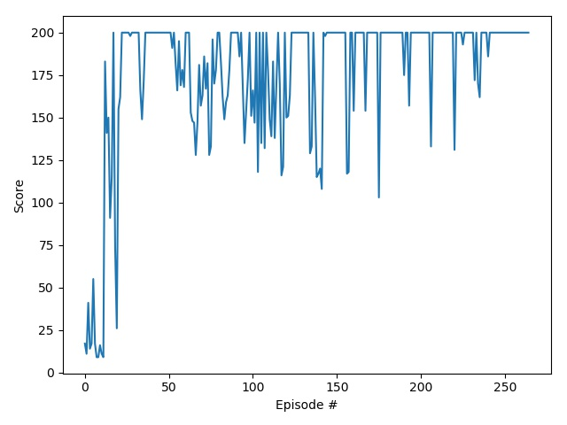
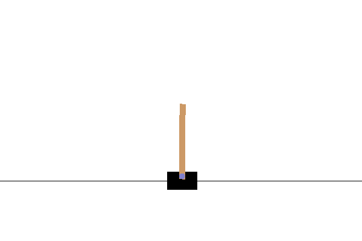
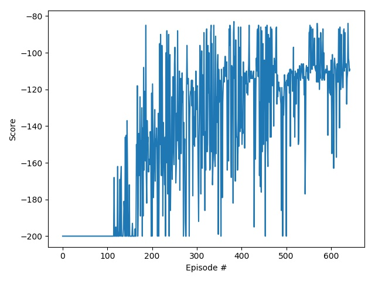
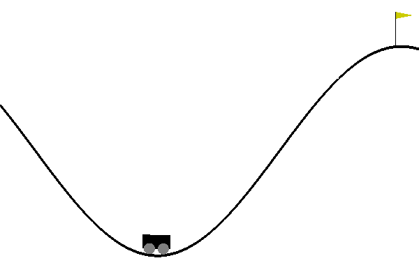

## Deep Q Networks

Generic implementation of Deep Q Networks using Keras for the purpose of solving RL control tasks having discrete action space.

### Requirements :
```
numpy
matplotlib
keras
imageio
gym (OpenAI Gym)
```

### Help :
```
$ python main_driver -h
```

### Environments :
List of OpenAI Gym Environments which are solved by agents in this repo: 
- #### CartPole-v0
    **Targeted Reward** (over 100 consecutive itrs) : >= 195 <br>
    **Reward Achieved** (over 100 consecutive itrs) : 200.0 <br>
    **Episodes before solve :**  265<br>
    
    Following are the commands used to train & test the model(includes the necessary hyperparameters):
    - *Command to train :* ```python3 main_driver,py train CartPole-v0 --itr-count 2000 -b 64 -lr 0.0001 --gamma 0.99 --render False --avg-expected-reward -110.0```
    
    - *Command to test :* ```python3 main_driver,py test CartPole-v0 --render True --avg-expected-reward 195 --test-total-iterations 100 --model-path "best_save/CartPole-v0_local_model_1534607382.5808585.h5"```
    
    **Result Log Files:**
    - Training : [result_train_CartPole-v0_1534607382.5808585.log](results/result_train_CartPole-v0_1534607382.5808585.log)
    - Testing : [result_test_CartPole-v0_1534607382.5808585.log](results/result_test_CartPole-v0_1534607382.5808585.log)
    
    **Detailed Log Files:**
    - Training : [train_CartPole-v0_1534607382.5808585.log](logs/train_CartPole-v0_1534607382.5808585.log)
    - Testing : [test_CartPole-v0_1534607382.5808585.log](logs/test_CartPole-v0_1534607382.5808585.log)
    
    *Reward Plot:*<br>
    
    
    *Agent Playing the Env:*<br>
    
    

----
    
- #### MountainCar-v0
    **Targeted Reward** (over 100 consecutive itrs) : >= -110 <br>
    **Reward Achieved** (over 100 consecutive itrs) : -108.85 <br>
    **Episodes before solve :**  643<br>
    
    Following are the commands used to train & test the model(includes the necessary hyperparameters):
    - *Command to train :* ```python3 main_driver,py train MountainCar-v0 --itr-count 2000 -b 64 -lr 0.0001 --gamma 0.99 --render False --avg-expected-reward -110.0```
    
    - *Command to test :* ```python3 main_driver,py test MountainCar-v0 --render True --avg-expected-reward -110 --test-total-iterations 100 --model-path "best_save/MountainCar-v0_local_model_1534667457.5695965.h5"```
    
    **Result Log Files:**
    - Training : [result_train_MountainCar-v0_1534667457.5695965.log](results/result_train_MountainCar-v0_1534667457.5695965.log)
    - Testing : [result_test_MountainCar-v0_1534667457.5695965.log](results/result_test_MountainCar-v0_1534667457.5695965.log)
    
    **Detailed Log Files:**
    - Training : [train_MountainCar-v0_1534667457.5695965.log](logs/train_MountainCar-v0_1534667457.5695965.log)
    - Testing : [test_MountainCar-v0_1534667457.5695965.log](logs/test_MountainCar-v0_1534667457.5695965.log)
    
    *Reward Plot:*<br>
    
    
    *Agent Playing the Env:*<br>
    
